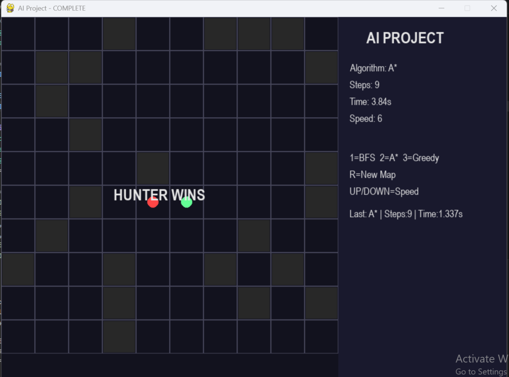
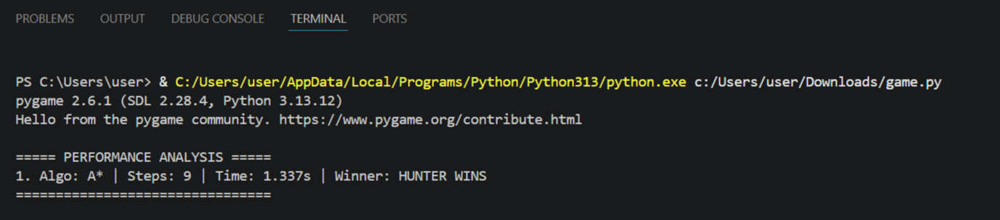
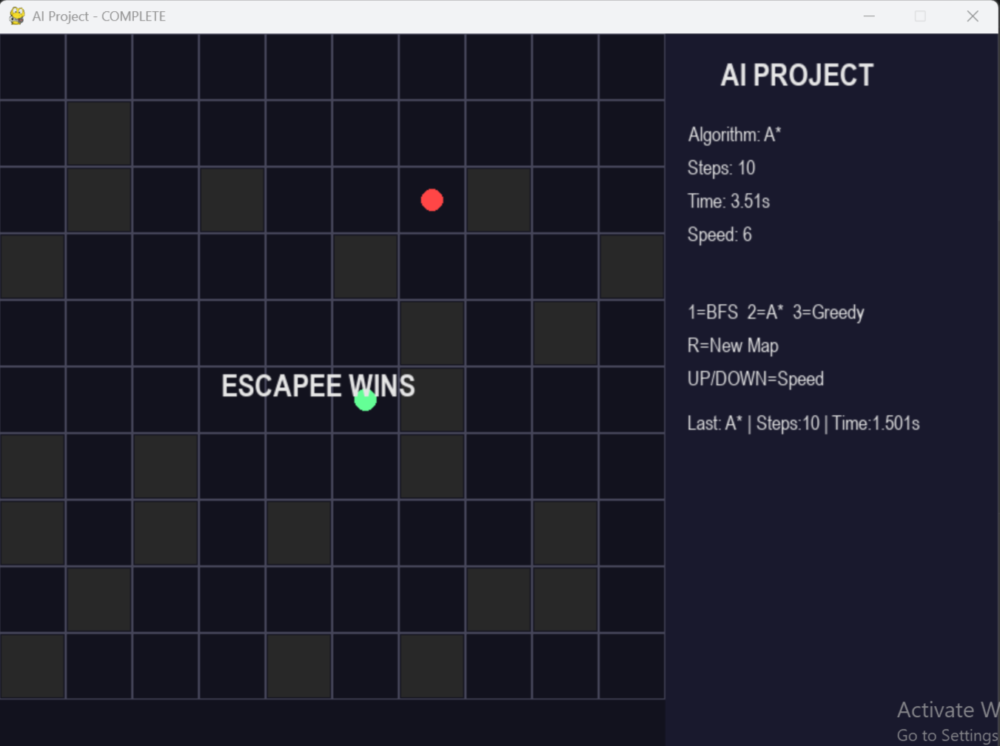
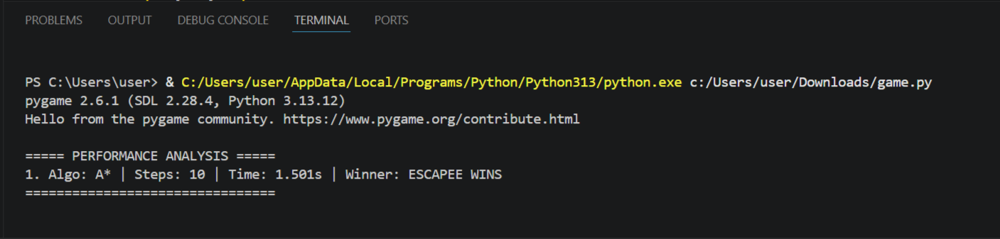

AI Hunter vs Escapee Project
Overview

This project simulates an intelligent chase scenario:

🔵 Escapee tries to reach a goal
🔴 Hunter tries to catch the escapee

It demonstrates classical AI search algorithms with real-time visualization.

Algorithms Used
BFS (Breadth-First Search) → Uninformed Search
A* → Heuristic Search
Greedy Best-First Search
Controls
1 → BFS
2 → A*
3 → Greedy
R → Generate new map
↑ / ↓ → Change speed
Performance Analysis

The system tracks:

Number of steps taken
Execution time
Comparison between algorithms
Technologies Used
Python
Pygame
Features
Agent-based simulation
Dynamic grid environment
Real-time visualization
Performance comparison
Multiple test scenarios
Screenshot

Author

Mahnoor Fatima
